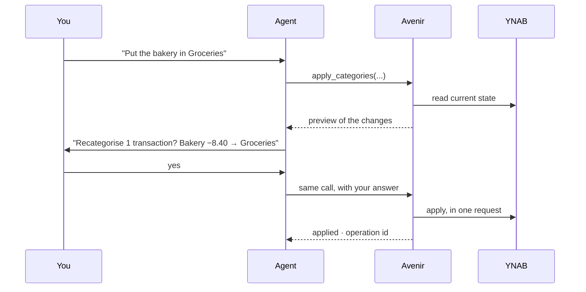

# Safety by design

An agent that can change your budget should never surprise you. Avenir has four
layers of protection.

## 1. Read-only by default

Tools that change your budget carry a `write` tag. Unless `AVENIR_MCP_WRITE=1` is set,
they are **neither listed nor callable**: the agent cannot even try.

Every tool also declares [MCP annotations](../reference/tools.md) — read-only or not,
destructive or not, safe to repeat or not — so your client can decide how much to
ask you.

## 2. Preview, then confirm

Every write first computes what it would change and shows it. It applies nothing
until you say yes.

How the question reaches you depends on your client:

| Your client | What you see |
|---|---|
| Supports MCP *elicitation* | A confirmation box to tick, shown by the client itself. |
| Does not, or runs unattended | The preview in the conversation, and a **single-use code** the agent must pass back — only after you agreed. |

A confirmation is **bound to the exact preview**: a code expires after 10 minutes,
works once, and confirms those changes and no others. If the budget changes between
the preview and your answer, the answer is refused and a new preview is needed.
Ticking nothing, or refusing, changes nothing.

## 3. Undo

Applied operations are recorded in a local journal (see
[`AVENIR_MCP_JOURNAL`](../reference/configuration.md)) — identifiers only, no amounts
or names, readable by you only. `undo_operation` reverts the latest operation, or the
one you name:

| Operation | Undo |
|---|---|
| `apply_categories` | every transaction goes back to its previous category |
| `set_category_budget` | the previous amount is restored |
| `reconcile_account` | transactions go back to *cleared*; the adjustment is deleted |
| `create_transactions` | the created transactions are deleted |

Anything changed again since the operation is **left alone** and reported: undo never
overwrites later work.

## 4. Bank text is untrusted

Payee names and memos come from banks, merchants and anyone who can send you money.
A memo can carry text written to manipulate an agent. Avenir returns such text as
data, truncated, and never turns it into instructions. Its
[evaluation](../evaluation.md) hides an instruction in a memo and checks the agent
ignores it.
